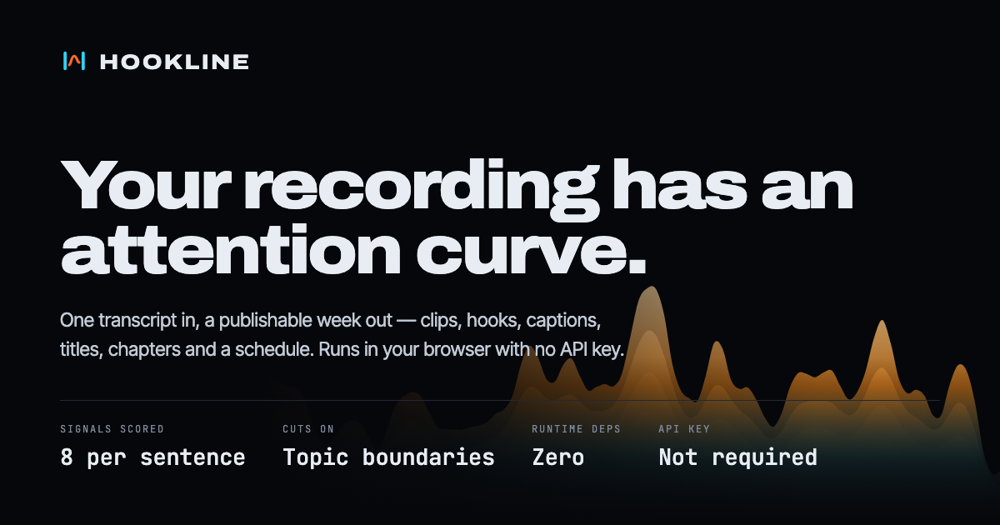

# HOOKLINE

**One long-form recording in. A publishable week of channel output out.**

HOOKLINE measures where a recording holds attention, cuts it at the points where the subject
actually changes, and returns ranked clips with rewritten hooks, platform titles, word-timed
captions, hashtags, thumbnail concepts, chapter markers and a posting schedule.

It runs entirely in the browser — no account, no upload, no API key — and the identical engine
runs as a Node CLI that writes the whole package to disk, including an `ffmpeg` script that
renders each clip vertically with captions burned in.

**→ [Try it](https://rishikrrontala-bot.github.io/hookline/)** · nothing to install, nothing to
sign up for. Hit *Analyse a transcript*, load a sample, and the whole package is generated in
your own tab in about 40ms.

**→ [Browse real output](examples/the-algorithm-episode/)** without running anything: every file
in `examples/` was produced by the CLI from the sample transcripts in `samples/`.

```bash
npm install
npm run dev      # the workspace at http://localhost:5273
npm run demo     # CLI: analyse the sample and write out/demo
npm run og       # regenerate the social card from the engine's own curve
```

---

## The problem

Clipping is the tax on long-form. For a 45-minute episode, finding six good clips, trimming
them, writing hooks, writing titles for three platforms, timing captions and scheduling the
result is four to six hours. Every week. Forever.

The tempting fix is to ask a language model to "find the good parts". It returns the parts that
**summarise** well — which is the opposite of what holds attention. A summary is a thing that
removes the reason to watch.

## The mechanism

HOOKLINE does not ask a model which moments are good. It measures the transcript.

**1 · Eight signals, scored per sentence.** Each is an independent 0–1 measurement with a named,
inspectable basis — not a hidden embedding.

| Signal | Weight | What it measures |
| --- | --- | --- |
| Hook | 20% | Opening construction that stops a scroll — direct address, imperatives, superlatives, framed questions |
| Curiosity | 16% | An open loop: contrast pivots, withheld information, forward reference |
| Salience | 15% | TF-IDF mass — how much of the recording's actual subject the line carries |
| Charge | 13% | Valence magnitude. Both poles hold attention; a flat line does not |
| Concrete | 12% | Numbers, units, named entities — specificity that resists paraphrase |
| Payoff | 9% | Resolution markers that close a loop rather than opening another |
| Quotable | 9% | Short, declarative, strong-verbed — the shape of a line that survives being cut out |
| Pace | 6% | Delivery rate against the speaker's own baseline |

Discourse management is penalised rather than rewarded: "let me be specific about what I mean"
is short, first-person and direct, so a naive scorer loves it — but it is stage direction, not
content. Pace is **withheld entirely** when a transcript arrives without real timings, rather
than scored on synthesised ones.

**2 · Topic boundaries by lexical cohesion.** Two windows of *k* sentences slide across the
transcript; at each gap the cosine similarity of their TF-IDF vectors is measured. Where that
overlap collapses, the subject has changed. Valleys deeper than `mean + 0.4σ` become boundaries
— the TextTiling criterion. Clips may only start and end at, or very near, one of them, which is
what keeps a clip from ending mid-thought. The same boundaries produce the chapter markers, so
the two outputs never disagree about where a topic began.

**3 · Candidate windows and non-maximum suppression.** Every valid window is scored on a weighted
objective, then reduced greedily by temporal IoU so results never overlap, with a penalty on
reusing a topic segment so a week is not six cuts of the same three minutes.

```
score = 0.34·opening + 0.26·body + 0.14·payoff + 0.14·containment + 0.12·boundary-fit
```

`opening` is weighted hardest deliberately: on a vertical feed the first line either works or
nothing else is seen. `containment` penalises a clip that opens on a pronoun with no antecedent —
pronouns without antecedents kill more clips than weak hooks do.

**4 · Generation from the speaker's own words.** Hooks are re-framed, never invented: the engine
detects the rhetorical shape already present and tightens it. Multi-word phrases are verified as
contiguous n-grams the speaker actually said, so a title never contains a phrase assembled from
separately-ranked words.

## What comes out

```
examples/the-algorithm-episode/
├── clips/          one Markdown brief per clip — hook, titles, description,
│                   hashtags, thumbnail spec, b-roll, transcript, signal readout
├── captions/       SRT + VTT per clip, wrapped for a vertical safe area,
│                   timed by distributing each sentence across its words
├── thumbnails/     9:16 SVG layout proofs with overlay text and grab timecode
├── metadata/       channel titles, description with chapters, tags, full analysis JSON
├── chapters.txt    paste straight into the source video description
├── schedule.csv    a week of posts with times, platforms and placement reasons
└── cut.sh          ffmpeg — renders every clip vertically with captions burned in
```

```bash
./examples/the-algorithm-episode/cut.sh /path/to/source-video.mp4
```

## CLI

```bash
npm run cli -- <transcript.srt|.vtt|.txt> [options]

  -o, --out <dir>        Output directory                     (default: out)
  -n, --clips <n>        Number of clips to extract           (default: 6)
      --min <sec>        Minimum clip length                  (default: 16)
      --max <sec>        Maximum clip length                  (default: 60)
      --title "<text>"   Source recording title
      --platforms <list> youtube-shorts,tiktok,instagram-reels,x,linkedin
      --enhance          Rewrite hooks and titles with Claude (needs ANTHROPIC_API_KEY)
      --json             Print the analysis as JSON instead of a report
```

Input formats: **SRT**, **WebVTT**, pasted **YouTube transcripts** with timecodes, and **plain
prose**. Prose gets timings synthesised from a words-per-minute model, and the engine records
that it did — the pace signal is withheld rather than faked.

## The optional Claude pass

`--enhance`, or a key pasted into the workspace, sends only the selected clips' transcripts to
Claude to rewrite **hooks and titles**. It is strictly additive:

- The deterministic result is already complete and publishable before any model is involved.
- Clip selection, timings, captions, chapters and the schedule are **measurements** and are never
  sent for rewriting.
- Every failure mode — no key, network error, malformed response, over-length output — falls back
  to the deterministic text rather than degrading it.

There is no path where a missing key produces an error state or an empty result.

## Architecture

```
src/engine/     dependency-free TypeScript. No DOM, no fs, no framework.
                Runs unchanged in the browser and in Node.
  ingest.ts       format detection, cue parsing, timing synthesis
  stats.ts        TF-IDF, smoothing, phrase extraction, subject terms
  signals.ts      the eight scorers and the attention curve
  segment.ts      TextTiling lexical-cohesion segmentation
  clips.ts        candidate windows, scoring, non-maximum suppression
  generate/       hooks, titles, captions, SEO, thumbnails
  schedule.ts     weekly placement
  enhance.ts      the optional Claude pass
src/cli/        Node CLI — writes the export package
src/app/        Vite + React workspace, and the WebGL attention terrain
```

The engine has **zero runtime dependencies**. That is what makes one implementation serve both
the CLI and the browser, and what makes the analysis reproducible: the same transcript yields the
same clips, every time, on any machine.

## Design

The interface is documented in [DESIGN.md](DESIGN.md); product decisions in
[PRODUCT.md](PRODUCT.md). The 3D terrain renders the analysed attention curve — height and heat
are the measurement, not decoration — and everything it shows is also present as text and as a 2D
curve, so it stills entirely under `prefers-reduced-motion`.

## Honest limits

- It analyses **text**. It does not cut video; it emits the timecodes, subtitle files and metadata
  an editor or the generated `ffmpeg` step consumes.
- It cannot make a bad recording good. If an hour was spent saying nothing, no clipper finds the
  moment, because the moment is not there. This is amplification, not creation.
- The "time saved" figure is an estimate of manual effort replaced at twelve minutes per clip. It
  is not a claim about reach, and nothing in the tool predicts views.
- Posting-time slots encode ordinary platform convention. They are a defensible default to
  override, not a measurement.

## Sample data

`samples/the-algorithm-episode.srt` (10 min, SRT with timecodes) and
`samples/founder-interview.txt` (4 min, plain prose) are both written for this project and are
the only content used in the interface. There are no users, customers, testimonials or benchmarks
behind this — anything that looked like one would be fabricated.
